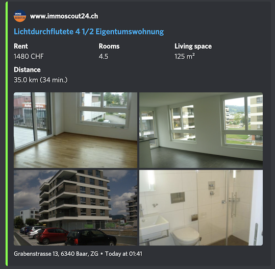

# 🇨🇭 Swiss Immobilien Scraper 🏡

Scrape Swiss real estate websites for new listings and post them to Discord.

## Features

Every new listing is formatted into a neat Discord embed and immediately sent to a channel via a webhook.

The data presented in the embed includes:
  * Monthly rent in CHF
  * Number of rooms
  * Living space
  * Location
  * Images

Supported websites:
  * [immoscout24.ch](https://www.immoscout24.ch/en)
<p align="center" width="100%">
    
</p>

  * [homegate.ch](https://www.homegate.ch/en)
<p align="center" width="100%">
    
</p>


### Customization

You can edit the URLs that will be scraped periodically. Simply select your desired filters on the Immo websites and paste the URLs into [`etc/urls.json`](etc/urls.json) (`author_icon_url` is optional).


## Quickstart

**Environment variables**:
  * `DISCORD_WEBHOOK` = the webhook URL
  * `GOOGLE_MAPS_API_KEY` (optional) = API key for accessing Distance Matrix API

Don't forget to customize the URLs you want to scrape. E.g. if you are looking for any apartment in Zurich (up to 2000 CHF/mo) you can use the default values in `urls.json`. Otherwise provide your own URLs.

How to run the script:
1. Docker container
2. Running the script directly after installing requirements

### Docker

Build and run the image from the supplied `Dockerfile` or use `sh build-and-run.sh`.

### Manual

Python version `3.10+` is required. Install `requirements.txt` on your virtual environment and run the script from the root of the repo.

```
$ pip install -r requirements.txt
...
$ python3 -m app.main -f etc/urls.json
2022-03-27 01:16:01.154 app.manager.www.immoscout24.ch INFO     Initialized
2022-03-27 01:16:01.154 app.manager.www.homegate.ch INFO     Initialized
```

## Google Distance Matrix API
This script optionally computes the distance and duration from the listing address to your destination address. For instance, from the listed apartment address to your work address.

In order to use this feature, don't forget to set the `GOOGLE_MAPS_API_KEY` environment variable. This functionality is *enabled* by default.

To disable, start the script with a `--no-google-maps` flag.