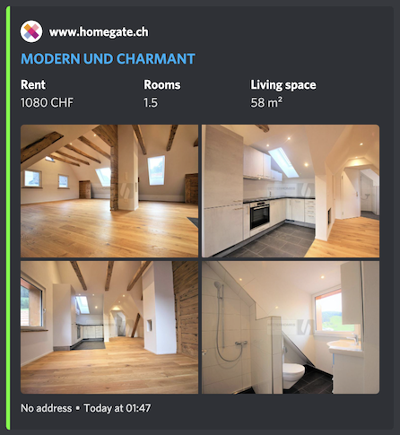

# 🇨🇭 Swiss Immobilien Scraper 🏡

<p align="center">
  <a href="https://hub.docker.com/repository/docker/dvdblk/swiss-immo-scraper" alt="Docker Version">
    
  </a>
  <a href="https://hub.docker.com/repository/docker/dvdblk/swiss-immo-scraper" alt="Docker Pulls">
    
  </a>
  <a href="https://hub.docker.com/repository/docker/dvdblk/swiss-immo-scraper" alt="Docker Image size">
    
  </a>
  <a href="LICENSE" alt="GitHub License">
    
  </a>
</p>

Scrape Swiss real estate websites for new apartment listings and post them to Discord.

## Features

Every new listing is formatted into a neat Discord embed and immediately sent to a channel.

The data presented in the embed includes:
  * Monthly rent in CHF
  * Number of rooms
  * Living space
  * Location
  * Images
  * Distance (optional)

Supported websites:
  * [immoscout24.ch](https://www.immoscout24.ch/en)
<p align="center" width="100%">
    
</p>

  * [homegate.ch](https://www.homegate.ch/en)
<p align="center" width="100%">
    
</p>


### Customization

You can edit the URLs that will be scraped periodically. Simply select your desired filters on the Immo websites, copy the URLs and set them as an ENV Variable (`SCRAPE_URLS`).


## Quickstart

**Environment variables**:
| ENV_VAR | Description | Required |
|---|---|---|
| DISCORD_WEBHOOK | New apartments will be sent to this Discord channel. | Yes |
| SCRAPE_URLS | a list of URLs to scrape (can contain multiple URLs per one hostname) | Yes |
| GOOGLE_MAPS_API_KEY | API key for accessing Distance Matrix API (optional) | No |
| GOOGLE_MAPS_DESTINATION | The destination address to use when computing distance to a new apartment listing | No |

How to run the script:
1. Docker container
2. Running the script directly after installing requirements

### Docker

Build and run the image from the supplied `Dockerfile` or use `sh build-and-run.sh`.

### Manual

Python version `3.10+` is required. Install `requirements.txt` on your virtual environment and run the script from the root of the repo.

```
$ pip install -r requirements.txt
...
$ python3 -m app.main -f etc/urls.json
2022-03-27 01:16:01.154 app.manager.www.immoscout24.ch INFO     Initialized
2022-03-27 01:16:01.154 app.manager.www.homegate.ch INFO     Initialized
```

## Google Distance Matrix API
This script optionally computes the distance and duration from the listing address to your destination address. For instance, from the listed apartment address to your work address.

In order to use this feature, don't forget to set the `GOOGLE_MAPS_API_KEY` environment variable.
